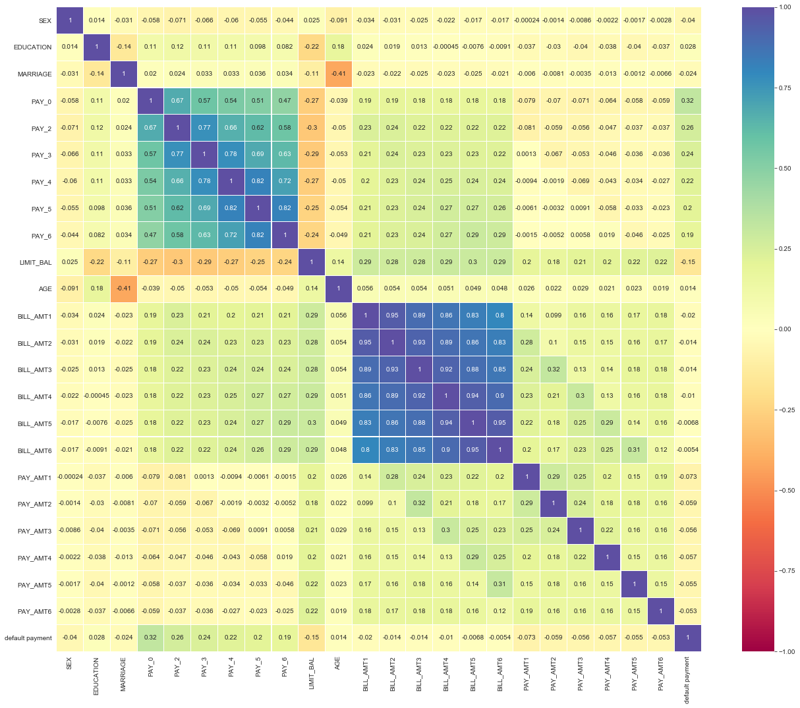

```python
!pip install catboost
```


```python
import pandas as pd 
import numpy as np
import matplotlib.pyplot as plt
import seaborn as sns
import gc
import os
from datetime import datetime 
from sklearn.model_selection import KFold,StratifiedKFold,train_test_split
from sklearn.metrics import roc_auc_score,f1_score
from sklearn.ensemble import RandomForestClassifier  # Bagging
from sklearn.tree import DecisionTreeClassifier
from sklearn.neighbors import KNeighborsClassifier
from catboost import CatBoostClassifier   # Boosting
```


```python
data = pd.read_csv('DataSceinceSeries.csv')
# Spelling of science was wrong in the sheet by the recruiter
```


```python
data.columns
```


    Index(['ID', 'LIMIT_BAL', 'SEX', 'EDUCATION', 'MARRIAGE', 'AGE', 'PAY_0',
           'PAY_2', 'PAY_3', 'PAY_4', 'PAY_5', 'PAY_6', 'BILL_AMT1', 'BILL_AMT2',
           'BILL_AMT3', 'BILL_AMT4', 'BILL_AMT5', 'BILL_AMT6', 'PAY_AMT1',
           'PAY_AMT2', 'PAY_AMT3', 'PAY_AMT4', 'PAY_AMT5', 'PAY_AMT6',
           'default payment'],
          dtype='object')


```python
data.info() # Checking for null and dtypes
```

    <class 'pandas.core.frame.DataFrame'>
    RangeIndex: 30000 entries, 0 to 29999
    Data columns (total 25 columns):
     #   Column           Non-Null Count  Dtype
    ---  ------           --------------  -----
     0   ID               30000 non-null  int64
     1   LIMIT_BAL        30000 non-null  int64
     2   SEX              30000 non-null  int64
     3   EDUCATION        30000 non-null  int64
     4   MARRIAGE         30000 non-null  int64
     5   AGE              30000 non-null  int64
     6   PAY_0            30000 non-null  int64
     7   PAY_2            30000 non-null  int64
     8   PAY_3            30000 non-null  int64
     9   PAY_4            30000 non-null  int64
     10  PAY_5            30000 non-null  int64
     11  PAY_6            30000 non-null  int64
     12  BILL_AMT1        30000 non-null  int64
     13  BILL_AMT2        30000 non-null  int64
     14  BILL_AMT3        30000 non-null  int64
     15  BILL_AMT4        30000 non-null  int64
     16  BILL_AMT5        30000 non-null  int64
     17  BILL_AMT6        30000 non-null  int64
     18  PAY_AMT1         30000 non-null  int64
     19  PAY_AMT2         30000 non-null  int64
     20  PAY_AMT3         30000 non-null  int64
     21  PAY_AMT4         30000 non-null  int64
     22  PAY_AMT5         30000 non-null  int64
     23  PAY_AMT6         30000 non-null  int64
     24  default payment  30000 non-null  int64
    dtypes: int64(25)
    memory usage: 5.7 MB
    

* Luckily there are no missing values


```python
data.head()
```


<div>
<style scoped>
    .dataframe tbody tr th:only-of-type {
        vertical-align: middle;
    }

    .dataframe tbody tr th {
        vertical-align: top;
    }

    .dataframe thead th {
        text-align: right;
    }
</style>
<table border="1" class="dataframe">
  <thead>
    <tr style="text-align: right;">
      <th></th>
      <th>ID</th>
      <th>LIMIT_BAL</th>
      <th>SEX</th>
      <th>EDUCATION</th>
      <th>MARRIAGE</th>
      <th>AGE</th>
      <th>PAY_0</th>
      <th>PAY_2</th>
      <th>PAY_3</th>
      <th>PAY_4</th>
      <th>PAY_5</th>
      <th>PAY_6</th>
      <th>BILL_AMT1</th>
      <th>BILL_AMT2</th>
      <th>BILL_AMT3</th>
      <th>BILL_AMT4</th>
      <th>BILL_AMT5</th>
      <th>BILL_AMT6</th>
      <th>PAY_AMT1</th>
      <th>PAY_AMT2</th>
      <th>PAY_AMT3</th>
      <th>PAY_AMT4</th>
      <th>PAY_AMT5</th>
      <th>PAY_AMT6</th>
      <th>default payment</th>
    </tr>
  </thead>
  <tbody>
    <tr>
      <th>0</th>
      <td>1</td>
      <td>20000</td>
      <td>2</td>
      <td>2</td>
      <td>1</td>
      <td>24</td>
      <td>2</td>
      <td>2</td>
      <td>-1</td>
      <td>-1</td>
      <td>-2</td>
      <td>-2</td>
      <td>3913</td>
      <td>3102</td>
      <td>689</td>
      <td>0</td>
      <td>0</td>
      <td>0</td>
      <td>0</td>
      <td>689</td>
      <td>0</td>
      <td>0</td>
      <td>0</td>
      <td>0</td>
      <td>1</td>
    </tr>
    <tr>
      <th>1</th>
      <td>2</td>
      <td>120000</td>
      <td>2</td>
      <td>2</td>
      <td>2</td>
      <td>26</td>
      <td>-1</td>
      <td>2</td>
      <td>0</td>
      <td>0</td>
      <td>0</td>
      <td>2</td>
      <td>2682</td>
      <td>1725</td>
      <td>2682</td>
      <td>3272</td>
      <td>3455</td>
      <td>3261</td>
      <td>0</td>
      <td>1000</td>
      <td>1000</td>
      <td>1000</td>
      <td>0</td>
      <td>2000</td>
      <td>1</td>
    </tr>
    <tr>
      <th>2</th>
      <td>3</td>
      <td>90000</td>
      <td>2</td>
      <td>2</td>
      <td>2</td>
      <td>34</td>
      <td>0</td>
      <td>0</td>
      <td>0</td>
      <td>0</td>
      <td>0</td>
      <td>0</td>
      <td>29239</td>
      <td>14027</td>
      <td>13559</td>
      <td>14331</td>
      <td>14948</td>
      <td>15549</td>
      <td>1518</td>
      <td>1500</td>
      <td>1000</td>
      <td>1000</td>
      <td>1000</td>
      <td>5000</td>
      <td>0</td>
    </tr>
    <tr>
      <th>3</th>
      <td>4</td>
      <td>50000</td>
      <td>2</td>
      <td>2</td>
      <td>1</td>
      <td>37</td>
      <td>0</td>
      <td>0</td>
      <td>0</td>
      <td>0</td>
      <td>0</td>
      <td>0</td>
      <td>46990</td>
      <td>48233</td>
      <td>49291</td>
      <td>28314</td>
      <td>28959</td>
      <td>29547</td>
      <td>2000</td>
      <td>2019</td>
      <td>1200</td>
      <td>1100</td>
      <td>1069</td>
      <td>1000</td>
      <td>0</td>
    </tr>
    <tr>
      <th>4</th>
      <td>5</td>
      <td>50000</td>
      <td>1</td>
      <td>2</td>
      <td>1</td>
      <td>57</td>
      <td>-1</td>
      <td>0</td>
      <td>-1</td>
      <td>0</td>
      <td>0</td>
      <td>0</td>
      <td>8617</td>
      <td>5670</td>
      <td>35835</td>
      <td>20940</td>
      <td>19146</td>
      <td>19131</td>
      <td>2000</td>
      <td>36681</td>
      <td>10000</td>
      <td>9000</td>
      <td>689</td>
      <td>679</td>
      <td>0</td>
    </tr>
  </tbody>
</table>
</div>


We have 3 types of bill and pay: 
* by look it seems

>**PAY_X** values are sometimes of category

>**BILL_AMTX** are numeric 

>**PAY_AMTX** is again numeric


```python
data.PAY_0.unique()  # yep our intuition was right
```


    array([ 2, -1,  0, -2,  1,  3,  4,  8,  7,  5,  6])


* Lets look into more details about data


```python
data.describe()
```


<div>
<style scoped>
    .dataframe tbody tr th:only-of-type {
        vertical-align: middle;
    }

    .dataframe tbody tr th {
        vertical-align: top;
    }

    .dataframe thead th {
        text-align: right;
    }
</style>
<table border="1" class="dataframe">
  <thead>
    <tr style="text-align: right;">
      <th></th>
      <th>ID</th>
      <th>LIMIT_BAL</th>
      <th>SEX</th>
      <th>EDUCATION</th>
      <th>MARRIAGE</th>
      <th>AGE</th>
      <th>PAY_0</th>
      <th>PAY_2</th>
      <th>PAY_3</th>
      <th>PAY_4</th>
      <th>PAY_5</th>
      <th>PAY_6</th>
      <th>BILL_AMT1</th>
      <th>BILL_AMT2</th>
      <th>BILL_AMT3</th>
      <th>BILL_AMT4</th>
      <th>BILL_AMT5</th>
      <th>BILL_AMT6</th>
      <th>PAY_AMT1</th>
      <th>PAY_AMT2</th>
      <th>PAY_AMT3</th>
      <th>PAY_AMT4</th>
      <th>PAY_AMT5</th>
      <th>PAY_AMT6</th>
      <th>default payment</th>
    </tr>
  </thead>
  <tbody>
    <tr>
      <th>count</th>
      <td>30000.000000</td>
      <td>30000.000000</td>
      <td>30000.000000</td>
      <td>30000.000000</td>
      <td>30000.000000</td>
      <td>30000.000000</td>
      <td>30000.000000</td>
      <td>30000.000000</td>
      <td>30000.000000</td>
      <td>30000.000000</td>
      <td>30000.000000</td>
      <td>30000.000000</td>
      <td>30000.000000</td>
      <td>30000.000000</td>
      <td>3.000000e+04</td>
      <td>30000.000000</td>
      <td>30000.000000</td>
      <td>30000.000000</td>
      <td>30000.000000</td>
      <td>3.000000e+04</td>
      <td>30000.00000</td>
      <td>30000.000000</td>
      <td>30000.000000</td>
      <td>30000.000000</td>
      <td>30000.000000</td>
    </tr>
    <tr>
      <th>mean</th>
      <td>15000.500000</td>
      <td>167484.322667</td>
      <td>1.603733</td>
      <td>1.853133</td>
      <td>1.551867</td>
      <td>35.485500</td>
      <td>-0.016700</td>
      <td>-0.133767</td>
      <td>-0.166200</td>
      <td>-0.220667</td>
      <td>-0.266200</td>
      <td>-0.291100</td>
      <td>51223.330900</td>
      <td>49179.075167</td>
      <td>4.701315e+04</td>
      <td>43262.948967</td>
      <td>40311.400967</td>
      <td>38871.760400</td>
      <td>5663.580500</td>
      <td>5.921163e+03</td>
      <td>5225.68150</td>
      <td>4826.076867</td>
      <td>4799.387633</td>
      <td>5215.502567</td>
      <td>0.221200</td>
    </tr>
    <tr>
      <th>std</th>
      <td>8660.398374</td>
      <td>129747.661567</td>
      <td>0.489129</td>
      <td>0.790349</td>
      <td>0.521970</td>
      <td>9.217904</td>
      <td>1.123802</td>
      <td>1.197186</td>
      <td>1.196868</td>
      <td>1.169139</td>
      <td>1.133187</td>
      <td>1.149988</td>
      <td>73635.860576</td>
      <td>71173.768783</td>
      <td>6.934939e+04</td>
      <td>64332.856134</td>
      <td>60797.155770</td>
      <td>59554.107537</td>
      <td>16563.280354</td>
      <td>2.304087e+04</td>
      <td>17606.96147</td>
      <td>15666.159744</td>
      <td>15278.305679</td>
      <td>17777.465775</td>
      <td>0.415062</td>
    </tr>
    <tr>
      <th>min</th>
      <td>1.000000</td>
      <td>10000.000000</td>
      <td>1.000000</td>
      <td>0.000000</td>
      <td>0.000000</td>
      <td>21.000000</td>
      <td>-2.000000</td>
      <td>-2.000000</td>
      <td>-2.000000</td>
      <td>-2.000000</td>
      <td>-2.000000</td>
      <td>-2.000000</td>
      <td>-165580.000000</td>
      <td>-69777.000000</td>
      <td>-1.572640e+05</td>
      <td>-170000.000000</td>
      <td>-81334.000000</td>
      <td>-339603.000000</td>
      <td>0.000000</td>
      <td>0.000000e+00</td>
      <td>0.00000</td>
      <td>0.000000</td>
      <td>0.000000</td>
      <td>0.000000</td>
      <td>0.000000</td>
    </tr>
    <tr>
      <th>25%</th>
      <td>7500.750000</td>
      <td>50000.000000</td>
      <td>1.000000</td>
      <td>1.000000</td>
      <td>1.000000</td>
      <td>28.000000</td>
      <td>-1.000000</td>
      <td>-1.000000</td>
      <td>-1.000000</td>
      <td>-1.000000</td>
      <td>-1.000000</td>
      <td>-1.000000</td>
      <td>3558.750000</td>
      <td>2984.750000</td>
      <td>2.666250e+03</td>
      <td>2326.750000</td>
      <td>1763.000000</td>
      <td>1256.000000</td>
      <td>1000.000000</td>
      <td>8.330000e+02</td>
      <td>390.00000</td>
      <td>296.000000</td>
      <td>252.500000</td>
      <td>117.750000</td>
      <td>0.000000</td>
    </tr>
    <tr>
      <th>50%</th>
      <td>15000.500000</td>
      <td>140000.000000</td>
      <td>2.000000</td>
      <td>2.000000</td>
      <td>2.000000</td>
      <td>34.000000</td>
      <td>0.000000</td>
      <td>0.000000</td>
      <td>0.000000</td>
      <td>0.000000</td>
      <td>0.000000</td>
      <td>0.000000</td>
      <td>22381.500000</td>
      <td>21200.000000</td>
      <td>2.008850e+04</td>
      <td>19052.000000</td>
      <td>18104.500000</td>
      <td>17071.000000</td>
      <td>2100.000000</td>
      <td>2.009000e+03</td>
      <td>1800.00000</td>
      <td>1500.000000</td>
      <td>1500.000000</td>
      <td>1500.000000</td>
      <td>0.000000</td>
    </tr>
    <tr>
      <th>75%</th>
      <td>22500.250000</td>
      <td>240000.000000</td>
      <td>2.000000</td>
      <td>2.000000</td>
      <td>2.000000</td>
      <td>41.000000</td>
      <td>0.000000</td>
      <td>0.000000</td>
      <td>0.000000</td>
      <td>0.000000</td>
      <td>0.000000</td>
      <td>0.000000</td>
      <td>67091.000000</td>
      <td>64006.250000</td>
      <td>6.016475e+04</td>
      <td>54506.000000</td>
      <td>50190.500000</td>
      <td>49198.250000</td>
      <td>5006.000000</td>
      <td>5.000000e+03</td>
      <td>4505.00000</td>
      <td>4013.250000</td>
      <td>4031.500000</td>
      <td>4000.000000</td>
      <td>0.000000</td>
    </tr>
    <tr>
      <th>max</th>
      <td>30000.000000</td>
      <td>1000000.000000</td>
      <td>2.000000</td>
      <td>6.000000</td>
      <td>3.000000</td>
      <td>79.000000</td>
      <td>8.000000</td>
      <td>8.000000</td>
      <td>8.000000</td>
      <td>8.000000</td>
      <td>8.000000</td>
      <td>8.000000</td>
      <td>964511.000000</td>
      <td>983931.000000</td>
      <td>1.664089e+06</td>
      <td>891586.000000</td>
      <td>927171.000000</td>
      <td>961664.000000</td>
      <td>873552.000000</td>
      <td>1.684259e+06</td>
      <td>896040.00000</td>
      <td>621000.000000</td>
      <td>426529.000000</td>
      <td>528666.000000</td>
      <td>1.000000</td>
    </tr>
  </tbody>
</table>
</div>


 30,000 distinct clients.

The average for the amount of credit card limit is **167,484**. The standard deviation is large, max value being 1 million.

Education level is mostly 1 .

Most of the clients are either marrined or single 

Average age  **35.5** years, with a standard deviation : **9.2**.

Assuming 0 for default payment means 'not default' and value 1 means 'default',  **mean of 0.221 means that there are 22.1% of credit card contracts that will default next month**.

* lets confirm our data imbalance


```python
sns.countplot(data['default payment'])
plt.title('Default Credit Card Clients \n default = 0, not default = 1');
```


* from above data imbalance metics best suited for model will be either:
* auc_roc
* f1_score( avg = 'micro' )


```python
plt.figure(figsize = (14,6))
sns.distplot(data['LIMIT_BAL'],kde=True,bins=200);
plt.title('Amount of credit limit - Density Plot');
```


* looks like maximum amout of credit limit is in range of 50k
Let's check it


```python
data['LIMIT_BAL'].value_counts().head(5)
```


    50000     3365
    20000     1976
    30000     1610
    80000     1567
    200000    1528
    Name: LIMIT_BAL, dtype: int64


* lets group credit limit balance by target


```python
plt.figure(figsize = (14,6))
sns.distplot(data[data['default payment']==0]['LIMIT_BAL'],kde=True,bins=200,label='deafult');
sns.distplot(data[data['default payment']==1]['LIMIT_BAL'],kde=True,bins=200,label='not default');
plt.legend()
plt.title('Amount of credit limit - Density Plot grouped by target');
```


* Majorly defaults are for credit limits 0-100,000
* Larger defaults number are for the amounts of 50,000, 20,000 and 30,000.

lets check credit limit for sex


```python
plt.figure(1,figsize=(20,8))
sns.boxplot(data=data,x='SEX',y="LIMIT_BAL",hue=tar)
```


    <matplotlib.axes._subplots.AxesSubplot at 0x7f40447fe160>


* The limit credit amount is quite balanced between sexes. 

## Features correlation
* For the numeric values, let's represent the features correlation.


```python
billamt = ['BILL_AMT1','BILL_AMT2','BILL_AMT3','BILL_AMT4','BILL_AMT5','BILL_AMT6']

plt.figure(figsize = (12,8))
plt.title('BILL AMT 1- 6')
sns.heatmap(data[billamt].corr(),annot=True,cmap='Blues');
```


* Correlation is decreasing with distance from 1 to 6


```python
payamt = ['PAY_AMT1', 'PAY_AMT2', 'PAY_AMT3', 'PAY_AMT4', 'PAY_AMT5']
plt.figure(figsize = (12,8))
plt.title('PAY AMT 1- 6')
sns.heatmap(data[payamt].corr(),annot=True,cmap='Blues');
```


* There are no correlations between PAY_AMT1-6


## Whole Dataset feature Corelation
* Calculating pair correlation coefficient helps to better understand nature of feature's interaction with each other and final label


```python
hm = data[cols+[tar]].corr()
```


```python
plt.figure(1,figsize=(22,18))
sns.heatmap(hm,vmax=1,vmin=-1,square=True,annot=True,cmap='Spectral',linecolor='white',linewidth=0.1);
```





* Figure above shows that while features associated with **'BILL_AMT'** are highly correlated to each other, yet have minimum contribution to target label **'default payment'**.
* **'PAY'** features are also correlated but at the same time they show highest contribution to the final label.
* The negative correlation of **'SEX'** and **'MARRIAGE'** is also interesting.

###  Let's analyze sex, education, age and marriage distributions.


```python
t = ["SEX",'EDUCATION']
```


    ['SEX', 'EDUCATION']


```python
plt.figure(1,figsize=(8,6))
sns.boxplot(data = data, x="MARRIAGE",y='AGE',hue = 'SEX' )
```


    <matplotlib.axes._subplots.AxesSubplot at 0x7f40369ce278>


* Married sex 1 have mean age above married sex 2. Unmarried sex 1 have mean value for age above unmarried sex 2 as well but closer.


```python
plt.figure(1,figsize=(16,6))
plt.title('Variation of Credit LIMIT with Sex and education')
sns.boxplot(data = data, hue="EDUCATION",y='LIMIT_BAL',x = 'SEX' );
```


```python
plt.figure(1,figsize=(16,6))
plt.title('Variation of age with marriage and education')
sns.boxplot(data = data, x="EDUCATION",y='AGE',hue = 'MARRIAGE' );
```


```python
plt.figure(1,figsize=(14,6))
plt.title('Variation of Credit Limit with marriage and education')
sns.boxplot(data = data, x="MARRIAGE",y='LIMIT_BAL',hue = 'EDUCATION' );
```


```python
cat = ['SEX', 'EDUCATION', 'MARRIAGE','PAY_0','PAY_2', 'PAY_3', 'PAY_4', 'PAY_5', 'PAY_6']
cont = [ 'LIMIT_BAL','AGE','BILL_AMT1', 'BILL_AMT2',
       'BILL_AMT3', 'BILL_AMT4', 'BILL_AMT5', 'BILL_AMT6', 'PAY_AMT1',
       'PAY_AMT2', 'PAY_AMT3', 'PAY_AMT4', 'PAY_AMT5', 'PAY_AMT6']
tar = 'default payment'
cols = cat+cont
```

## Lets split our data for ML model
* We will use **StratifiedKFold** cross validation


```python
data['kfold'] = -1
train = data.sample(frac=1.0, random_state=2020).reset_index(drop=True)
y = train[tar].values
kf = StratifiedKFold(n_splits=6)
for fold, (trn_, val_) in enumerate(kf.split(X=train,y=y)):
  train.loc[val_,'kfold'] = fold
train.to_csv('data_kfold.csv',index=False)
```

## Lets first use simple models before ensemble models


* we will use **Decision tree** and **KNeighbourClassifier**.


Both work good with high dimensions


```python
X_train, X_test, y_train, y_test = train_test_split(train[cat+cont], train[[tar]], test_size=0.20, random_state=42)
```


```python
classifier = DecisionTreeClassifier(max_depth=10, random_state=14) 
classifier.fit(X_train, y_train)
predictions = classifier.predict(X_test)
roc_auc_score(y_test, predictions)
```


    0.6653089141793734


* Let's use GridSearchCV for finding best parameters


```python
from sklearn.model_selection import GridSearchCV
```


```python
param_grid = {'max_depth': np.arange(3, 10),
             'criterion' : ['gini','entropy'],
             'max_leaf_nodes': [5,10,20,100],
             'min_samples_split': [2, 5, 10, 20]}


grid_tree = GridSearchCV(DecisionTreeClassifier(), param_grid, cv = 5, scoring= 'accuracy')


#training
grid_tree.fit(X_train, y_train)
#let's see the best estimator
print(grid_tree.best_estimator_)
#with its score
print(np.abs(grid_tree.best_score_))
```

    DecisionTreeClassifier(ccp_alpha=0.0, class_weight=None, criterion='entropy',
                           max_depth=4, max_features=None, max_leaf_nodes=20,
                           min_impurity_decrease=0.0, min_impurity_split=None,
                           min_samples_leaf=1, min_samples_split=2,
                           min_weight_fraction_leaf=0.0, presort='deprecated',
                           random_state=None, splitter='best')
    0.8178333333333334
    


```python
classifier = DecisionTreeClassifier(ccp_alpha=0.0, class_weight=None, criterion='entropy',
                       max_depth=4, max_features=None, max_leaf_nodes=20,
                       min_impurity_decrease=0.0, min_impurity_split=None,
                       min_samples_leaf=1, min_samples_split=2,
                       min_weight_fraction_leaf=0.0, presort='deprecated',
                       random_state=None, splitter='best')

classifier.fit(X_train, y_train)
predictions = classifier.predict(X_test)
roc_auc_score(y_test, predictions)
```


    0.6609547595129749


* Does imporve at all

* lets use another simple KNeighbourclassifier


```python
clf = KNeighborsClassifier(n_neighbors=5,n_jobs=-1)
clf.fit(X_train, y_train)
predictions = clf.predict(X_test)
roc_auc_score(y_test, predictions)

```


    0.5483601158374439


* Its even worse

## Now lets use ensemble models :
* Basic predictor will be again a decision tree:
### Two main classes of ensemble are:
* **Bagging ensambles**: which reduce the chances of overfitting by running a series of uncostrained learners in parallel and combine them
* **Boosting Ensemble** : Boosting is a general ensemble method that creates a strong classifier from a number of weak classifiers. This is done by building a model from the training data, then creating a second model that attempts to correct the errors from the first model.

* Source -- wikipedia

Model I will use

* Bagging : RandomForestClassifier
* Boosting : Catboost -- performs best with more categorical models

## RandomForestClassifier


```python
train.kfold.unique()
```


    array([5])


```python
X_train, y_train = train[train.kfold!=3][cat+cont], train[train.kfold!=3][[tar]]
X_test, y_test = train[train.kfold==3][cat+cont], train[train.kfold==3][[tar]]
```


```python
clf = RandomForestClassifier(n_jobs=-1, 
                             random_state=2020,
                             criterion='gini',
                             n_estimators=100,
                             verbose=1)
clf.fit(X_train,y_train)
pred = clf.predict(X_test)
sc= roc_auc_score(y_test, pred)
print('roc_auc_score ',sc)
```

    <ipython-input-28-b96ee25ec197>:6: DataConversionWarning: A column-vector y was passed when a 1d array was expected. Please change the shape of y to (n_samples,), for example using ravel().
      clf.fit(X_train,y_train)
    [Parallel(n_jobs=-1)]: Using backend ThreadingBackend with 4 concurrent workers.
    [Parallel(n_jobs=-1)]: Done  42 tasks      | elapsed:    4.2s
    [Parallel(n_jobs=-1)]: Done 100 out of 100 | elapsed:    9.8s finished
    [Parallel(n_jobs=4)]: Using backend ThreadingBackend with 4 concurrent workers.
    [Parallel(n_jobs=4)]: Done  42 tasks      | elapsed:    0.1s
    

    roc_auc_score  0.6696953907852856
    

    [Parallel(n_jobs=4)]: Done 100 out of 100 | elapsed:    0.2s finished
    

## Feature selection


```python
f = clf.feature_importances_
plt.figure(1,figsize=(20,6))
sns.barplot(y=f,x=X_train.columns.tolist())
plt.title('feature importances')
plt.xticks(np.arange(len(f)),X_train[cols[:]].columns.tolist(),rotation=90);
```


```python
print('roc_auc_score ',sc)
```

    roc_auc_score  0.6696953907852856
    

* A slight improvement

## Lets use a Boosting ensemble


```python
X_train.head()
```


<div>
<style scoped>
    .dataframe tbody tr th:only-of-type {
        vertical-align: middle;
    }

    .dataframe tbody tr th {
        vertical-align: top;
    }

    .dataframe thead th {
        text-align: right;
    }
</style>
<table border="1" class="dataframe">
  <thead>
    <tr style="text-align: right;">
      <th></th>
      <th>SEX</th>
      <th>EDUCATION</th>
      <th>MARRIAGE</th>
      <th>PAY_0</th>
      <th>PAY_2</th>
      <th>PAY_3</th>
      <th>PAY_4</th>
      <th>PAY_5</th>
      <th>PAY_6</th>
      <th>LIMIT_BAL</th>
      <th>...</th>
      <th>BILL_AMT3</th>
      <th>BILL_AMT4</th>
      <th>BILL_AMT5</th>
      <th>BILL_AMT6</th>
      <th>PAY_AMT1</th>
      <th>PAY_AMT2</th>
      <th>PAY_AMT3</th>
      <th>PAY_AMT4</th>
      <th>PAY_AMT5</th>
      <th>PAY_AMT6</th>
    </tr>
  </thead>
  <tbody>
    <tr>
      <th>0</th>
      <td>1</td>
      <td>3</td>
      <td>0</td>
      <td>-1</td>
      <td>-1</td>
      <td>-1</td>
      <td>-1</td>
      <td>0</td>
      <td>-1</td>
      <td>200000</td>
      <td>...</td>
      <td>9212</td>
      <td>2529</td>
      <td>1036</td>
      <td>4430</td>
      <td>5020</td>
      <td>9236</td>
      <td>2529</td>
      <td>0</td>
      <td>4430</td>
      <td>6398</td>
    </tr>
    <tr>
      <th>1</th>
      <td>2</td>
      <td>2</td>
      <td>2</td>
      <td>0</td>
      <td>0</td>
      <td>0</td>
      <td>0</td>
      <td>0</td>
      <td>0</td>
      <td>230000</td>
      <td>...</td>
      <td>118467</td>
      <td>108826</td>
      <td>100862</td>
      <td>92481</td>
      <td>6000</td>
      <td>6000</td>
      <td>4000</td>
      <td>4000</td>
      <td>3500</td>
      <td>4000</td>
    </tr>
    <tr>
      <th>2</th>
      <td>2</td>
      <td>2</td>
      <td>1</td>
      <td>2</td>
      <td>2</td>
      <td>2</td>
      <td>2</td>
      <td>2</td>
      <td>2</td>
      <td>150000</td>
      <td>...</td>
      <td>71434</td>
      <td>72365</td>
      <td>73377</td>
      <td>75052</td>
      <td>3000</td>
      <td>3300</td>
      <td>2700</td>
      <td>2800</td>
      <td>3000</td>
      <td>2800</td>
    </tr>
    <tr>
      <th>3</th>
      <td>2</td>
      <td>2</td>
      <td>2</td>
      <td>0</td>
      <td>0</td>
      <td>0</td>
      <td>0</td>
      <td>0</td>
      <td>2</td>
      <td>230000</td>
      <td>...</td>
      <td>93143</td>
      <td>87654</td>
      <td>90172</td>
      <td>86850</td>
      <td>4500</td>
      <td>4114</td>
      <td>3500</td>
      <td>4000</td>
      <td>3000</td>
      <td>3000</td>
    </tr>
    <tr>
      <th>4</th>
      <td>2</td>
      <td>1</td>
      <td>2</td>
      <td>0</td>
      <td>0</td>
      <td>0</td>
      <td>0</td>
      <td>0</td>
      <td>2</td>
      <td>360000</td>
      <td>...</td>
      <td>23707</td>
      <td>24145</td>
      <td>24068</td>
      <td>24350</td>
      <td>1800</td>
      <td>1800</td>
      <td>1000</td>
      <td>1649</td>
      <td>1003</td>
      <td>3</td>
    </tr>
  </tbody>
</table>
<p>5 rows × 23 columns</p>
</div>


```python
from tqdm.notebook import tqdm
```

### Cross Validation CatBoost Model


```python
fold_score = {}
test_sc = {}
ts_org = train[train['kfold']==5]
trn = train[train['kfold']!=5]
ls = ['Logloss', 'CrossEntropy', 'MultiClass', 'MultiClassOneVsAll']
catboost_model = CatBoostClassifier(
                    iterations = 100,
                    verbose = 20,
                    #learning_rate = 0.15,
                    loss_function = ls[0],
                    )
for i in tqdm(range(5)):
    print('--'*(5*i),'fold---> ',i)
    X_train ,y_train = trn[trn['kfold']!=i], trn[trn['kfold']!=i][[tar]]
     
    X_test ,y_test = trn[trn['kfold']==i], trn[trn['kfold']==i][[tar]]
    
    catboost_model.fit(
            X_train[cols], y_train[tar].values,
            cat_features =[0,1,2,3,4,5,6,7,8], #[ 0,  1,  2, 4,  5,  6,  7,  8,  9, 10, 11, 12],
            eval_set=(X_test[cols], y_test[tar].values),plot=False,
                )
    
    y_pred = catboost_model.predict(X_test[cols])
    y_pred1 = catboost_model.predict_proba(X_test[cols])[:,1]
    
    score1, score2 = roc_auc_score(y_test, y_pred1), f1_score(y_test,y_pred,average='micro')
    
    print("---"*(30),'----')
    print('--'*(20))
    print('roc_auc : ',score1,'|  f1_score : ',score2)
    print("---"*(30),'----')
    
    y_pred_p = catboost_model.predict_proba(ts_org[cols[:]])[:,1]
    
    name = 'fold__'+str(i)
    test_sc[name] = y_pred_p
    fold_score[name] = y_pred1 
    
test_sc = np.column_stack((test_sc['fold__0'],
                           test_sc['fold__1'],
                           test_sc['fold__2'],
                           test_sc['fold__3'],
                           test_sc['fold__4'],
                               ))

fin_ac = roc_auc_score(ts_org[tar].values,test_sc.mean(axis=1))

print("Final AUROC ",fin_ac)
    
print("---"*(30),'feature importances')
f = catboost_model.feature_importances_
plt.figure(1,figsize=(20,8))
sns.barplot(y=f,x=X_train[cols].columns.tolist())
plt.title('feature importances')
plt.xticks(np.arange(len(f)),X_train[cols[:]].columns.tolist(),rotation=90);
```


    HBox(children=(FloatProgress(value=0.0, max=5.0), HTML(value='')))


     fold--->  0
    Learning rate set to 0.180827
    0:	learn: 0.6225085	test: 0.6229698	best: 0.6229698 (0)	total: 114ms	remaining: 11.3s
    20:	learn: 0.4241649	test: 0.4282498	best: 0.4282498 (20)	total: 2.54s	remaining: 9.54s
    40:	learn: 0.4143871	test: 0.4249923	best: 0.4249923 (40)	total: 5.09s	remaining: 7.32s
    60:	learn: 0.4064143	test: 0.4250353	best: 0.4247506 (58)	total: 7.84s	remaining: 5.01s
    80:	learn: 0.3984547	test: 0.4245818	best: 0.4245818 (80)	total: 10.7s	remaining: 2.51s
    99:	learn: 0.3910350	test: 0.4245724	best: 0.4244661 (81)	total: 13.3s	remaining: 0us
    
    bestTest = 0.4244661383
    bestIteration = 81
    
    Shrink model to first 82 iterations.
    ------------------------------------------------------------------------------------------ ----
    ----------------------------------------
    roc_auc :  0.784419113747584 |  f1_score :  0.8208
    ------------------------------------------------------------------------------------------ ----
    ---------- fold--->  1
    Learning rate set to 0.180827
    0:	learn: 0.6235122	test: 0.6245792	best: 0.6245792 (0)	total: 166ms	remaining: 16.4s
    20:	learn: 0.4239371	test: 0.4298314	best: 0.4298314 (20)	total: 3.54s	remaining: 13.3s
    40:	learn: 0.4134652	test: 0.4265804	best: 0.4265692 (39)	total: 6.18s	remaining: 8.9s
    60:	learn: 0.4066819	test: 0.4264950	best: 0.4263646 (53)	total: 9.11s	remaining: 5.83s
    80:	learn: 0.3985106	test: 0.4266516	best: 0.4262372 (61)	total: 12s	remaining: 2.82s
    99:	learn: 0.3933596	test: 0.4262300	best: 0.4262300 (99)	total: 14.4s	remaining: 0us
    
    bestTest = 0.4262300461
    bestIteration = 99
    
    ------------------------------------------------------------------------------------------ ----
    ----------------------------------------
    roc_auc :  0.7824069301220128 |  f1_score :  0.8202
    ------------------------------------------------------------------------------------------ ----
    -------------------- fold--->  2
    Learning rate set to 0.180827
    0:	learn: 0.6232415	test: 0.6238820	best: 0.6238820 (0)	total: 113ms	remaining: 11.1s
    20:	learn: 0.4220953	test: 0.4375522	best: 0.4375522 (20)	total: 3s	remaining: 11.3s
    40:	learn: 0.4128431	test: 0.4351357	best: 0.4351357 (40)	total: 5.88s	remaining: 8.47s
    60:	learn: 0.4072536	test: 0.4344326	best: 0.4344326 (60)	total: 8.28s	remaining: 5.29s
    80:	learn: 0.3986350	test: 0.4334823	best: 0.4333135 (79)	total: 10.6s	remaining: 2.48s
    99:	learn: 0.3935107	test: 0.4341030	best: 0.4333135 (79)	total: 13.1s	remaining: 0us
    
    bestTest = 0.4333134768
    bestIteration = 79
    
    Shrink model to first 80 iterations.
    ------------------------------------------------------------------------------------------ ----
    ----------------------------------------
    roc_auc :  0.7722784438617951 |  f1_score :  0.8206
    ------------------------------------------------------------------------------------------ ----
    ------------------------------ fold--->  3
    Learning rate set to 0.180827
    0:	learn: 0.6226953	test: 0.6229890	best: 0.6229890 (0)	total: 154ms	remaining: 15.2s
    20:	learn: 0.4250836	test: 0.4279192	best: 0.4279192 (20)	total: 2.82s	remaining: 10.6s
    40:	learn: 0.4147919	test: 0.4241015	best: 0.4240263 (37)	total: 5.93s	remaining: 8.53s
    60:	learn: 0.4087061	test: 0.4242016	best: 0.4237365 (47)	total: 8.51s	remaining: 5.44s
    80:	learn: 0.4030064	test: 0.4247526	best: 0.4237365 (47)	total: 11.1s	remaining: 2.6s
    99:	learn: 0.3948367	test: 0.4245790	best: 0.4237365 (47)	total: 13.5s	remaining: 0us
    
    bestTest = 0.4237364947
    bestIteration = 47
    
    Shrink model to first 48 iterations.
    ------------------------------------------------------------------------------------------ ----
    ----------------------------------------
    roc_auc :  0.7830921313543069 |  f1_score :  0.8276
    ------------------------------------------------------------------------------------------ ----
    ---------------------------------------- fold--->  4
    Learning rate set to 0.180827
    0:	learn: 0.6226408	test: 0.6237821	best: 0.6237821 (0)	total: 128ms	remaining: 12.7s
    20:	learn: 0.4194507	test: 0.4417243	best: 0.4417243 (20)	total: 2.75s	remaining: 10.3s
    40:	learn: 0.4098626	test: 0.4400442	best: 0.4396881 (37)	total: 5.21s	remaining: 7.5s
    60:	learn: 0.4014778	test: 0.4395476	best: 0.4395476 (60)	total: 7.7s	remaining: 4.92s
    80:	learn: 0.3929089	test: 0.4397599	best: 0.4395476 (60)	total: 10.1s	remaining: 2.36s
    99:	learn: 0.3858293	test: 0.4404658	best: 0.4395476 (60)	total: 12.6s	remaining: 0us
    
    bestTest = 0.4395475703
    bestIteration = 60
    
    Shrink model to first 61 iterations.
    ------------------------------------------------------------------------------------------ ----
    ----------------------------------------
    roc_auc :  0.7749902246791327 |  f1_score :  0.8122
    ------------------------------------------------------------------------------------------ ----
    
    Final AUROC  0.7836581015351666
    ------------------------------------------------------------------------------------------ feature importances
    


* As show in above EDA sex is pretty balanced in representation of credit  limit balance, that's why it has very less contribution


```python
cm = pd.crosstab(y_test[tar].values, y_pred, rownames=['Actual'], colnames=['Predicted'])
print(cm)
fig, (ax1) = plt.subplots(ncols=1, figsize=(6,5))
sns.heatmap(cm, 
            xticklabels=['Not Fraud', 'Fraud'],
            yticklabels=['Not Fraud', 'Fraud'],
            annot=True,ax=ax1,
            linewidths=.2,linecolor="Darkblue", cmap="Blues")
plt.title('Confusion Matrix : Annot values are in percent', fontsize=14)
plt.show()
```

    Predicted     0    1
    Actual              
    0          3681  213
    1           726  380
    


## Let's see Neural Network Performance


```python
import tensorflow as tf
from tensorflow.keras.layers import Dense
from tensorflow.keras.models import Sequential
from tensorflow.keras.callbacks import EarlyStopping
from sklearn.utils import class_weight
```


```python
from sklearn.preprocessing import StandardScaler
from tensorflow.keras.utils import to_categorical
```


```python
predictors = data.drop(['ID','default payment'], axis=1).to_numpy()
predictors = StandardScaler().fit_transform(predictors)
target = to_categorical(data['default payment']) 
```


```python
num_cols = predictors.shape[1]
```


```python
model = Sequential()
model.add(Dense(200, activation='relu', input_shape = (num_cols,)))
model.add(tf.keras.layers.Dropout(.2)) # To avoid overfitting
model.add(Dense(300, activation='relu'))
model.add(tf.keras.layers.Dropout(.2))   # To avoid overfitting
model.add(Dense(100, activation='relu'))
model.add(tf.keras.layers.Dropout(.2))   # To avoid overfitting
model.add(Dense(2, activation='softmax'))
```


```python
model.summary()
```

    Model: "sequential_6"
    _________________________________________________________________
    Layer (type)                 Output Shape              Param #   
    =================================================================
    dense_24 (Dense)             (None, 200)               4800      
    _________________________________________________________________
    dropout_3 (Dropout)          (None, 200)               0         
    _________________________________________________________________
    dense_25 (Dense)             (None, 300)               60300     
    _________________________________________________________________
    dropout_4 (Dropout)          (None, 300)               0         
    _________________________________________________________________
    dense_26 (Dense)             (None, 100)               30100     
    _________________________________________________________________
    dropout_5 (Dropout)          (None, 100)               0         
    _________________________________________________________________
    dense_27 (Dense)             (None, 2)                 202       
    =================================================================
    Total params: 95,402
    Trainable params: 95,402
    Non-trainable params: 0
    _________________________________________________________________
    


```python
model.compile(loss='binary_crossentropy',
              optimizer='adam',
              metrics=[tf.keras.metrics.AUC()])
```


```python
data['default payment'].value_counts()/30000   # To get class weights
```


    0    0.7788
    1    0.2212
    Name: default payment, dtype: float64


```python
ratio = 0.2212
class_weight = {0:ratio, 1:1-ratio}
```


```python
history = model.fit(predictors, target, epochs=50, validation_split=0.3,class_weight=class_weight)
```

    Epoch 1/50
    657/657 [==============================] - 5s 7ms/step - loss: 0.2125 - auc_11: 0.7437 - val_loss: 0.5401 - val_auc_11: 0.8320
    Epoch 2/50
    657/657 [==============================] - 4s 7ms/step - loss: 0.2041 - auc_11: 0.7794 - val_loss: 0.5393 - val_auc_11: 0.8313
    Epoch 3/50
    657/657 [==============================] - 4s 7ms/step - loss: 0.2019 - auc_11: 0.7829 - val_loss: 0.5529 - val_auc_11: 0.8236
    Epoch 4/50
    657/657 [==============================] - 4s 7ms/step - loss: 0.2003 - auc_11: 0.7894 - val_loss: 0.5713 - val_auc_11: 0.7990
    Epoch 5/50
    657/657 [==============================] - 4s 7ms/step - loss: 0.1989 - auc_11: 0.7885 - val_loss: 0.5381 - val_auc_11: 0.8248
    Epoch 6/50
    657/657 [==============================] - 4s 7ms/step - loss: 0.1984 - auc_11: 0.7899 - val_loss: 0.4954 - val_auc_11: 0.8534
    Epoch 7/50
    657/657 [==============================] - 5s 7ms/step - loss: 0.1982 - auc_11: 0.7900 - val_loss: 0.5346 - val_auc_11: 0.8235
    Epoch 8/50
    657/657 [==============================] - 4s 7ms/step - loss: 0.1973 - auc_11: 0.7897 - val_loss: 0.5306 - val_auc_11: 0.8285
    Epoch 9/50
    657/657 [==============================] - 5s 7ms/step - loss: 0.1974 - auc_11: 0.7916 - val_loss: 0.5570 - val_auc_11: 0.8163
    Epoch 10/50
    657/657 [==============================] - 5s 7ms/step - loss: 0.1959 - auc_11: 0.7897 - val_loss: 0.5277 - val_auc_11: 0.8317
    Epoch 11/50
    657/657 [==============================] - 4s 7ms/step - loss: 0.1948 - auc_11: 0.7978 - val_loss: 0.5424 - val_auc_11: 0.8194
    Epoch 12/50
    657/657 [==============================] - 5s 7ms/step - loss: 0.1941 - auc_11: 0.7952 - val_loss: 0.5555 - val_auc_11: 0.8014
    Epoch 13/50
    657/657 [==============================] - 5s 7ms/step - loss: 0.1937 - auc_11: 0.7949 - val_loss: 0.5463 - val_auc_11: 0.8075
    Epoch 14/50
    657/657 [==============================] - 5s 7ms/step - loss: 0.1932 - auc_11: 0.7965 - val_loss: 0.5318 - val_auc_11: 0.8364
    Epoch 15/50
    657/657 [==============================] - 4s 7ms/step - loss: 0.1922 - auc_11: 0.8000 - val_loss: 0.5697 - val_auc_11: 0.7979
    Epoch 16/50
    657/657 [==============================] - 5s 8ms/step - loss: 0.1913 - auc_11: 0.7966 - val_loss: 0.5239 - val_auc_11: 0.8306
    Epoch 17/50
    657/657 [==============================] - 4s 7ms/step - loss: 0.1917 - auc_11: 0.8006 - val_loss: 0.5525 - val_auc_11: 0.8128
    Epoch 18/50
    657/657 [==============================] - 4s 7ms/step - loss: 0.1915 - auc_11: 0.7974 - val_loss: 0.5501 - val_auc_11: 0.8127
    Epoch 19/50
    657/657 [==============================] - 4s 7ms/step - loss: 0.1895 - auc_11: 0.8031 - val_loss: 0.5367 - val_auc_11: 0.8205
    Epoch 20/50
    657/657 [==============================] - 4s 7ms/step - loss: 0.1893 - auc_11: 0.8028 - val_loss: 0.5538 - val_auc_11: 0.8063
    Epoch 21/50
    657/657 [==============================] - 4s 7ms/step - loss: 0.1896 - auc_11: 0.8031 - val_loss: 0.5476 - val_auc_11: 0.8119
    Epoch 22/50
    657/657 [==============================] - 4s 7ms/step - loss: 0.1879 - auc_11: 0.8042 - val_loss: 0.5342 - val_auc_11: 0.8223
    Epoch 23/50
    657/657 [==============================] - 4s 7ms/step - loss: 0.1859 - auc_11: 0.8063 - val_loss: 0.5519 - val_auc_11: 0.8040
    Epoch 24/50
    657/657 [==============================] - 5s 7ms/step - loss: 0.1866 - auc_11: 0.8037 - val_loss: 0.5714 - val_auc_11: 0.7883
    Epoch 25/50
    657/657 [==============================] - 5s 7ms/step - loss: 0.1852 - auc_11: 0.8087 - val_loss: 0.5242 - val_auc_11: 0.8249
    Epoch 26/50
    657/657 [==============================] - 5s 7ms/step - loss: 0.1856 - auc_11: 0.8068 - val_loss: 0.5384 - val_auc_11: 0.8188
    Epoch 27/50
    657/657 [==============================] - 5s 7ms/step - loss: 0.1853 - auc_11: 0.8095 - val_loss: 0.5547 - val_auc_11: 0.8066
    Epoch 28/50
    657/657 [==============================] - 5s 7ms/step - loss: 0.1843 - auc_11: 0.8077 - val_loss: 0.5550 - val_auc_11: 0.8006
    Epoch 29/50
    657/657 [==============================] - 5s 7ms/step - loss: 0.1832 - auc_11: 0.8096 - val_loss: 0.5702 - val_auc_11: 0.7882
    Epoch 30/50
    657/657 [==============================] - 4s 7ms/step - loss: 0.1827 - auc_11: 0.8102 - val_loss: 0.5371 - val_auc_11: 0.8213
    Epoch 31/50
    657/657 [==============================] - 5s 7ms/step - loss: 0.1827 - auc_11: 0.8115 - val_loss: 0.5326 - val_auc_11: 0.8172
    Epoch 32/50
    657/657 [==============================] - 4s 7ms/step - loss: 0.1814 - auc_11: 0.8126 - val_loss: 0.5784 - val_auc_11: 0.7908
    Epoch 33/50
    657/657 [==============================] - 5s 7ms/step - loss: 0.1808 - auc_11: 0.8156 - val_loss: 0.5868 - val_auc_11: 0.7750
    Epoch 34/50
    657/657 [==============================] - 5s 7ms/step - loss: 0.1797 - auc_11: 0.8181 - val_loss: 0.5618 - val_auc_11: 0.7978
    Epoch 35/50
    657/657 [==============================] - 5s 7ms/step - loss: 0.1800 - auc_11: 0.8180 - val_loss: 0.5688 - val_auc_11: 0.7941
    Epoch 36/50
    657/657 [==============================] - 5s 7ms/step - loss: 0.1798 - auc_11: 0.8184 - val_loss: 0.5418 - val_auc_11: 0.8119
    Epoch 37/50
    657/657 [==============================] - 4s 7ms/step - loss: 0.1776 - auc_11: 0.8218 - val_loss: 0.5396 - val_auc_11: 0.8142
    Epoch 38/50
    657/657 [==============================] - 5s 7ms/step - loss: 0.1790 - auc_11: 0.8191 - val_loss: 0.5703 - val_auc_11: 0.7875
    Epoch 39/50
    657/657 [==============================] - 4s 7ms/step - loss: 0.1776 - auc_11: 0.8227 - val_loss: 0.5479 - val_auc_11: 0.8106
    Epoch 40/50
    657/657 [==============================] - 5s 8ms/step - loss: 0.1776 - auc_11: 0.8190 - val_loss: 0.5391 - val_auc_11: 0.8166
    Epoch 41/50
    657/657 [==============================] - 4s 7ms/step - loss: 0.1757 - auc_11: 0.8261 - val_loss: 0.5378 - val_auc_11: 0.8193
    Epoch 42/50
    657/657 [==============================] - 5s 7ms/step - loss: 0.1744 - auc_11: 0.8268 - val_loss: 0.5356 - val_auc_11: 0.8197
    Epoch 43/50
    657/657 [==============================] - 5s 7ms/step - loss: 0.1756 - auc_11: 0.8300 - val_loss: 0.5952 - val_auc_11: 0.7631
    Epoch 44/50
    657/657 [==============================] - 5s 7ms/step - loss: 0.1743 - auc_11: 0.8251 - val_loss: 0.5540 - val_auc_11: 0.8061
    Epoch 45/50
    657/657 [==============================] - 6s 9ms/step - loss: 0.1718 - auc_11: 0.8336 - val_loss: 0.5775 - val_auc_11: 0.7904
    Epoch 46/50
    657/657 [==============================] - 6s 9ms/step - loss: 0.1726 - auc_11: 0.8305 - val_loss: 0.5604 - val_auc_11: 0.8051
    Epoch 47/50
    657/657 [==============================] - 7s 10ms/step - loss: 0.1733 - auc_11: 0.8300 - val_loss: 0.5791 - val_auc_11: 0.7982
    Epoch 48/50
    657/657 [==============================] - 6s 9ms/step - loss: 0.1723 - auc_11: 0.8287 - val_loss: 0.5446 - val_auc_11: 0.8161
    Epoch 49/50
    657/657 [==============================] - 6s 9ms/step - loss: 0.1704 - auc_11: 0.8372 - val_loss: 0.5888 - val_auc_11: 0.7781
    Epoch 50/50
    657/657 [==============================] - 6s 9ms/step - loss: 0.1701 - auc_11: 0.8324 - val_loss: 0.5710 - val_auc_11: 0.7975
    


```python
auc = history.history['auc_11']
val_auc = history.history['val_auc_11']
print('Training AUC : ',np.array(auc).mean())
print('Validation AUC : ',np.array(val_auc).mean())
```

    Training AUC :  0.8073429203033448
    Validation AUC :  0.8101226365566254
    

## Conclusions

We investigated the data, checking for data unbalancing, visualizing the features and understanding the relationship between different features.   

**We then investigated 5 predictive models:**
* We started with **DecisionTreeClassifier**, for which we obtained an AUC scode of **0.66**. 
* Then we used **KNeighourClassifier**, which gave even worse AUC of **0.54**. 
* For the **RandomForrestClassifier** .The AUC score did not improved significantly in this case from DecisonTree.   
* Next We followed with an **CatBoostClassifier** model, with improved AUC score (**0.78**) over mean of 5 folds.   
* Then we experimented with a **Neural Network** model, for which the AUC score obtained was **0.81** which was the best so far.   
* We used both **train-validation split** and **cross-validation** to evaluate the model effectiveness to predict the target value.


```python

```
